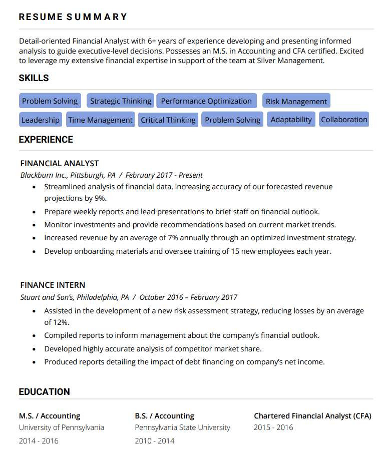

# Optical Character Recognition w/ Python-Tessarect to Extract Job Titles
This projects purpose is to serve as a starter template for running an OCR script and can be modified heavily to your own needs. 

A simple python flask implementation is used to upload the pdf file. Once uploaded it calls the optical character recognition python script (ocr.py) to extract job-titles. This script was initially created to extract job titles from a pdf, but it can be modified to extract pretty much anything from a pdf as long as it's supplied with the correct lists. Currently a sample text file containing job titles is uploaded, but it can be changed to whatever list of strings wanted as long as the list contains a string on every new line. To make the change rewrite the 'job_titles.txt' file to your required job titles or if you'd like to use multiple files simply upload the list to the project root folder and add it to the 'file_list' variable in ocr.py.

## Specifications:
- Python Flask for a quick User-Interface.
- pdf2image to convert PDF files to image files needed for the OCR
- Poppler is a requirment for pdf2image, it's a PDF rendering library for the xpdf-3.0 code base. You can download it locally, but for this case I added it as a folder for the library to point to. I'm not sure if it's system unique, but if it is then you'll have to download it locally and include it in the poppler folder. You can download the latest binary at --> https://blog.alivate.com.au/poppler-windows/. 
- Python-Tessarect for the OCR, YOU MUST download Python Tesseract on your local machcine and then edit the following line "pytesseract.pytesseract.tesseract_cmd = r'C:\Program Files\Tesseract-OCR\tesseract.exe'" in "ocr.py" to point to your tesseract.exe installation.

## How to run:
- cd to the root of the project and download the requirements.txt file by typing 'pip install -r requirements.txt', this will download all the neccessary libraries. If you don't want to install them on your machine then create a virtual enviornment for python, start the enviornment, and then use the above command.  
- to start the project simply run "python api.py" (from project root folder) which will start the flask application on http://localhost:3000.

## Input/Output:
Input:

  

Output:

  

If you look at the pdf, the ouput is missing Accounting, Finance Intern, and Intern. This is because our job_list does not cotain those job titles, the output will only be relevant to the occupation lists provided. Our list contained Education, Job Analyst, and Analyst so the output is correct for this specific list. 
